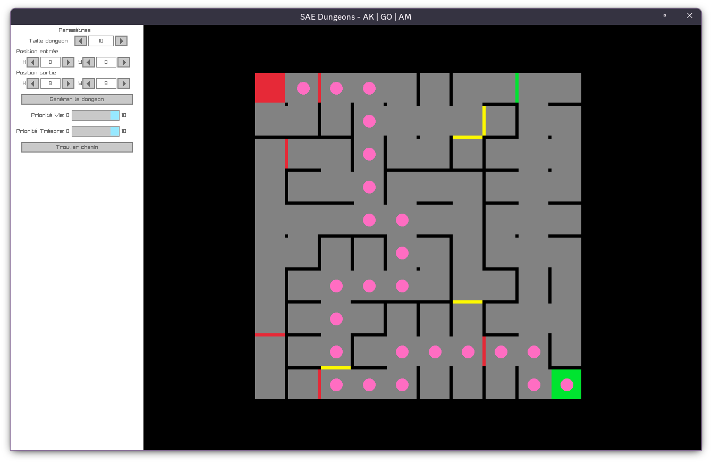

# 
SAE Donjon

---

## Auteurs

- Alexian Kujawski
- Axel MAS
- Gabriel OGER

## Fonctions

- Génération donjon
- Positionnement entré
- Positionnement sortie
- Configuration poids
- Affichage chemin
- Placement Objets
- Zoom et déplacement

## Controls

- ⬆️⬇️⬅️➡️, Déplacer la vue
- <kbd>+</kbd>/<kbd>°</kbd>, Zoomer/Dézoomer
- <kbd>R</kbd>, Réinitialiser la vue

## Légende

- Case Rouge : Entré
- Case Verte : Sortie
- Mur Vert : Monstre
- Mur Rouge : Fontaine de vie
- Mur Noir : Simple mur
- Mur Jaune : Trésor

## Optimisations

1. Spécialisation du Dijkstra: Une fois la sortie atteinte le dijkstra s'arrete
2. Occlusion: Seul les cases visible sont rendues
3. Le graph est stockés sous forme d'une matric d'adjacence de connections, une connection est une structure composée d'un enum (de type char) et d'une valeur de type short, revenant à 4 bytes par connections (la taille d'un 'int')

## Bugs

- Il est possible que le l'affichage du donjon place un mur sur le chemin du Dijsktra, cela se trouve etre un bug avec l'affiche.

## Compilation

### Nécessités

- Zig v0.12

### Étapes

1. `zig build run`
